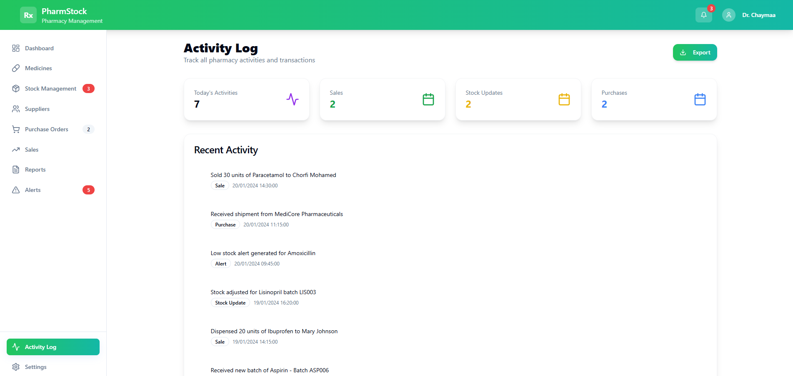

# Pharmacy Stock Management App
--------------------------------

A modern, responsive **React** application designed for pharmacy inventory and stock management. This application provides an intuitive interface for managing medicines, stock, suppliers, purchase orders, sales, reports, alerts, activity logs, and system settings. It uses mock data to simulate real-world pharmacy operations and provides forms for adding or updating medicines and other related data.

---

## Features
------------

### Dashboard

- **Welcome Section:** Personalized greeting and today's date.
- **Key Metrics:**  
  - Total Medicines  
  - Stock Value  
  - Today's Sales  
  - Active Alerts
- **Secondary Metrics:**  
  - Stock Levels with progress bars and low stock alerts  
  - Order Status (pending/completed)  
  - Expiry Alerts
- **Alerts & Activity:**  
  - Recent alerts with badges  
  - Recent activity log with timestamps

### Medicines Management

- List all medicines with **search** and **category filters**.
- **Add**, **Edit**, and **Delete** medicine entries.
- Export medicine data to **Excel** using `xlsx` and `file-saver`.
- Medicine cards displaying key details like stock, pricing, and supplier.

### Stock Management

- Track current stock levels.
- Update stock information and monitor low stock alerts.
- Visual progress bars for quick stock assessment.

### Suppliers & Purchase Orders

- Manage supplier information.

- Track purchase orders and fulfillment status.

### Sales Tracking

- Record daily sales and monitor revenue trends.
- Dashboard displays sales metrics at a glance.

### Reports

- Generate reports for medicines, stock, sales, and alerts.
- Exportable for offline review and audits.

### Alerts & Notifications

- Low stock and expiry alerts.
- Visual indicators for urgent actions.

### Activity Log

- Track all pharmacy activities and transactions.
- Filter and export activity logs.

### Settings

- Manage system preferences and toggle options with modern switches.
- Select appearance themes (Medical Blue, Health Green, Pharmacy Gold) with gradients and hover effects.

### Responsive Design
- Fully responsive for mobile, tablet, and desktop views.
- Modern UI with rounded cards, gradient buttons, hover effects, and smooth transitions.

---

## Technologies Used
-------------------
- **Frontend:** React, TypeScript
- **UI & Components:** Tailwind CSS, Lucide Icons
- **State & Navigation:** React Hooks, React Router
- **Data Export:** `xlsx`, `file-saver`
- **Mock Data:** Simulated inventory, metrics, and activity data

---

## File Structure Highlights
-----------------------------
- **`Dashboard.tsx`** – Displays metrics, stock levels, alerts, and recent activity.
- **`MedicineList.tsx`** – Medicine management with search, filter, add/edit/delete, and export.
- **`MedicineCard.tsx`** – Card component for individual medicine details.
- **`AddMedicineForm.tsx` / `UpdateFormMedicine.tsx`** – Forms for adding/updating medicines.
- **`ReportsPage.tsx`** – Summary reports for medicines, stock, and sales.
- **`AlertsPage.tsx`** – Shows all active alerts.
- **`ActivityPage.tsx`** – Displays recent pharmacy activities and logs.
- **`SettingsPage.tsx`** – System settings and appearance customization.
- **`ui/`** – Reusable UI components (buttons, cards, badges, inputs, switches, dropdowns).

---

## Installation
----------------
1. Clone the repository:  

git clone https://github.com/chorfichaymaa101/Pharmacy-Stock-Management.git
cd Pharmacy-Stock-Management

2. Install frontend dependencies:

npm install

3.Start the development server:

npm start

4. (Optional) Build for production:

npm run build
